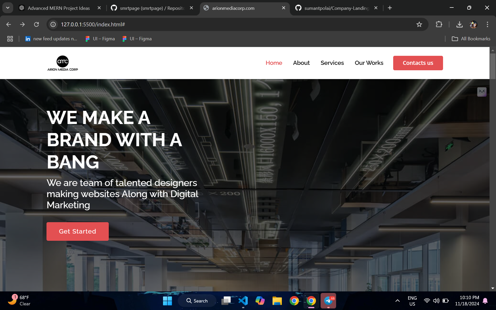
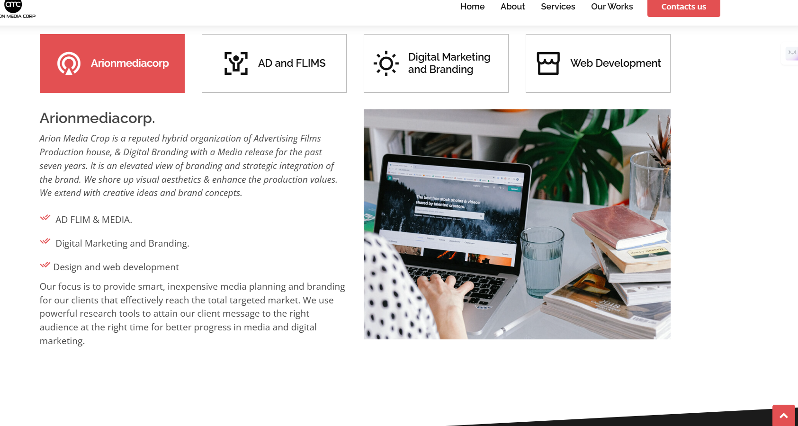
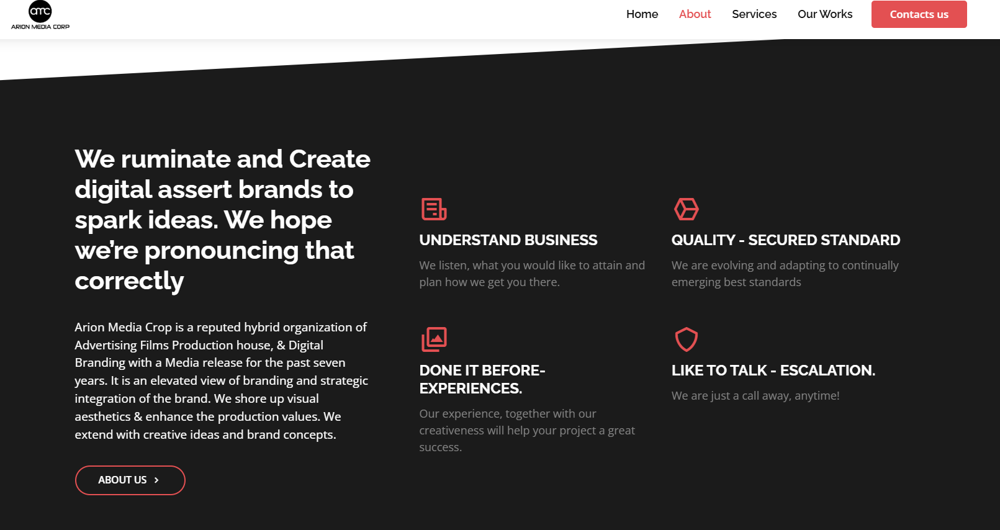
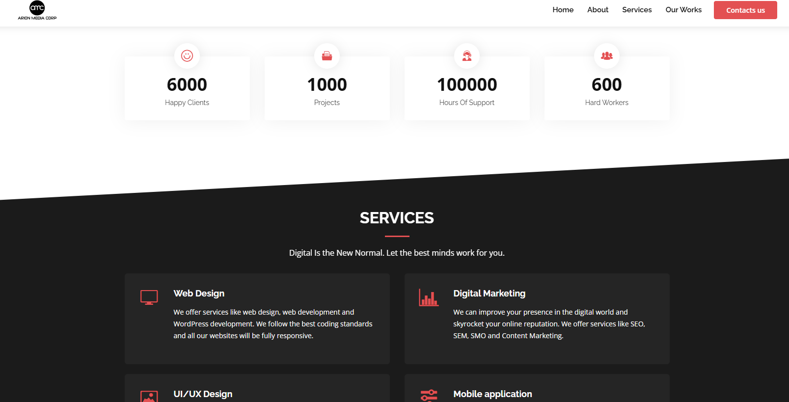
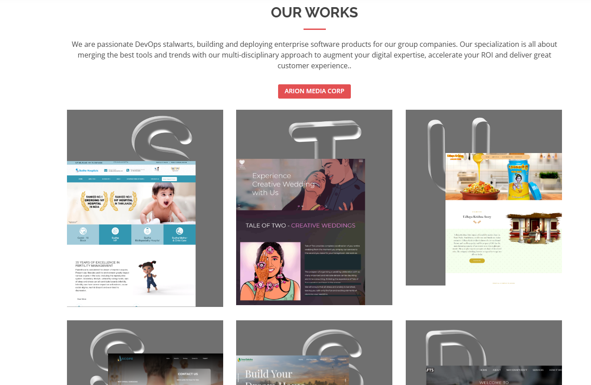
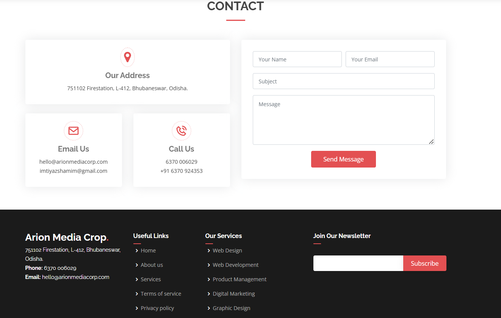

# Arion Media Corp Website Project  

This project is a website developed as part of an interview task for **Arion Media Corp**. The site includes multiple sections to showcase information about the company and its services.

## Features  

- **Home Page**: The main landing page introducing the company.  
- **About Us Page**: Information about the company’s mission and values.  
- **Understand Page**: Detailed explanations or guides about the services.  
- **Counter Page**: A dynamic counter to track stats.  
- **Profile Page**: A page for managing user profiles.  
- **Contact Page**: A form to reach out to the company.  

## Screenshots  

1. **Home Page**  
     

2. **About Us Page**  
     

3. **Understand Page**  
     

4. **Counter Page**  
     

5. **Profile Page**  
     

6. **Contact Page**  
     

 

 
